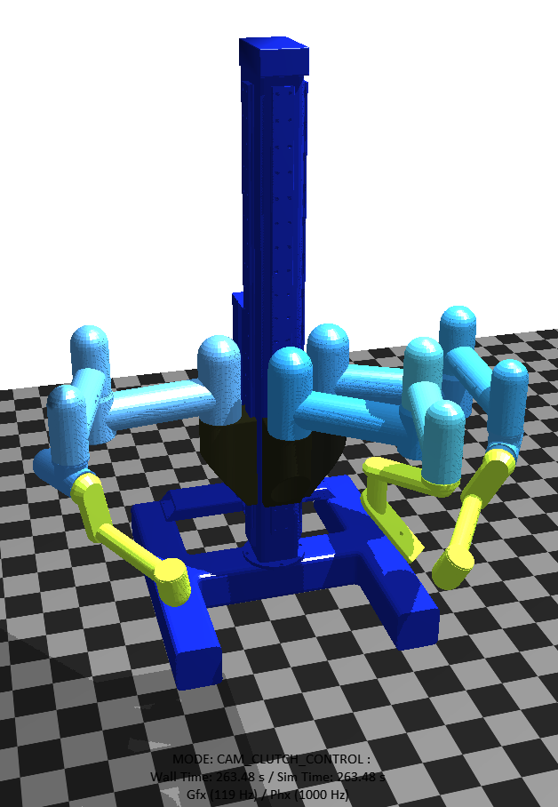

# Overview
This package provide a control interface for SUJs 

# Getting started
## Dependency
- Software: This package requires the installation of ROS.
- hardware: This package requires the SUJ control board from CUHK-BMT
## Install
open a terminal, type
```sh
cd ~
mkdir -p ros-ws/src
cd ros-ws/src
git clone https://github.com/CUHK-BRME/dvrk_suj_interface.git
cd ..
catkin_make
echo 'source ~/ros-ws/devel/setup.bash' >> ~/.bashrc 
```

## Run 
- Hardware: connect 3 USB from SUJ control board to your PC
- Software:

1. open one terminal ,type
```sh
sudo adduser $USER dialout
```
and log out your computer after this.


2. open one terminal, type
```sh
roscore
```
oepen another terminal, type
```sh
rosrun dvrk_suj_interface dvrk_suj_publisher_v2.py
```

## Test

Use the following command to test if your program is reading from sensors correctly and publishing the sensor data i ROS
```sh
rostopic echo -c /SUJ/ECM/measured_js
```

Use the following commands to test if the brake controlling function is functioning correctly
```sh
rostopic pub -1 /SUJ/PSM1/brake_control dvrk_suj_interface/Bool_List "isBrakeList: [1,1,1,1,1,1]" # for releasing all the brakes in PSM1
rostopic pub -1 /SUJ/PSM1/brake_control dvrk_suj_interface/Bool_List "isBrakeList: [0,0,0,0,0,0]" # for locking all the brakes in PSM1
```
If you want to test the basic serial communication with the board without the use of ROS as middleware, you may use the [test_serial_interface.py](scripts/test_serial_interface.py) scripts. By use the interactive mode of python you can use the defined methods to test the hardware. 


# Working with other packages

## dvrk_python interface
This interface compatible with dvrk python api's ```dvrk.suj``` class implementation, you may reference the exmaple script [test_crtk_interface.py](scripts/test_crtk_interface.py).

## ambf simulator
Using the modified ambf config files under the ```config``` folder, you can simulate the dVRK SUJ in ambf simulator. An example script [test_ambf_suj.py](scripts/test_ambf_suj.py) is provided for synchronizing the SUJ sensors reading with its digital twin in ambf. 

(** the control is unstable at the moment)

